# HairNet
---

- [Overview](#overview)
	- [Description](#description)
	- [Basic Usage](#basic-usage)
	- [Installation](#installation)
	- [Why Use This Add-on?](#why)
- [General Usage Info](#general-usage)
	- [The Active Object](#the-active-object)
	- [Root Determination](#root-determination)
	- ["Curve" vs "Curves"](#curve-vs-curves)
- [Preparing Your Proxies](#preparing-your-proxies)
	- [Fibermesh](#fibermesh)
	- [Curve(s)](#curves)
	- [Sheetmesh](#sheetmesh)
	- [Merge By Distance](#merge-by-distance)
- [Features](#features)
	- [Advanced Features](#advanced-features)
	- [Improvements](#improvements)
- [Limitations](#limitations)
- [Troubleshooting](#troubleshooting)
- [Contributing](#contributing)
	- [Places For Improvement](#places-for-improvement)
- [Report A Bug](#report-a-bug)
- [Buy Me A Coffee](#buy-me-a-coffee)
- [License](#license)

---

# Overview

 

> An Add-on for **Blender** that allows you to quick convert **proxy guides** into  **hair particles**
 

## Description

### v 1.0.0

This project is a fork of Jandals's [HairNet](https://github.com/Jandals/HairNet) originally created 13 years ago!

This version of ***HairNet*** is the same principle as the original, but with a complete codebase rewrite and **expanded functionality.**

Blender provides an **extensive suite** of tools to modify mesh and curves that it ***doesn't provide to particle hair***. 

This tool allows you to convert proxy mesh and curve(s) objects **directly into hair particles,** vastly speeding up your workflow.

## BASIC USAGE

1. Make sure you're in **object mode**
2. Select all of the objects you wish to use as particle hair guides
3. Select the object you wish to host the **particle system**
4. **Convert!**

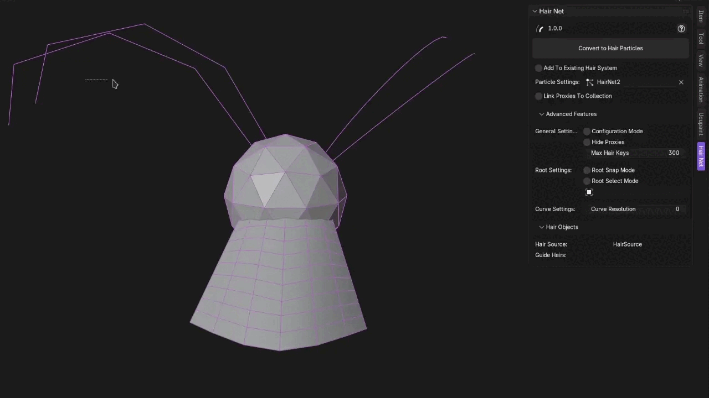

 ## INSTALLATION
 
 ### Pre-requisites
- **Blender 5.0.0+**

### Instructions
1. Download the zip archive of the latest release.
2. In Blender, click on **Edit > Preferences > Add-ons**
3. In the top right corner of the window is a drop down arrow. Click on it, and select ***"install from disk"***
4. Navigate to and select the downloaded zip file.

- For more help, see Blender's official [Add-ons](https://docs.blender.org/manual/en/latest/editors/preferences/addons.html) page.

## Why Use This Add-on?

Blender has a built in way of converting "Curves" objects to particle hair, and other objects into "Curves" objects. So why care about HairNet?

HairNet provides a number of feature improvements:

- Objects don't have to be joined to share a particle system.
- You can add proxies to an existing particle system.
- You don't have to reset your particle settings from scratch each time you convert (and there's **a lot** of particle settings)
- HairNet features [root snapping](#root-snap) which is essential for working with particle systems that have children.
- For curves, the process of determining the root hair key is based on the normals of the curve, and is therefore *tedious.* HairNet features [two modes](#root-locator) for automatically determining the root.
- HairNet gives you finer control over how many keys the final particle will have (except in the case of "Curves" objects, which give you equivalent control).
- HairNet will **always** add your proxy hair to the particle system **exactly** where you placed it. Blender's conversion will connect it directly to the mesh without any option to override this behavior.
- Converting from hair cards to particles is as simple as marking seams for each card, whereas "Curves" conversion would require deleting all of the faces, deleting extraneous edges, converting to "Curve," converting to "Curves," adjusting properties of "Curves," and then converting to particles (at which point Blender auto connects the particles resulting in your hair cards jumping away from where you'd originally placed them).

# General Usage Info

Prefer video guides? Check out: 

## The Active Object

Hair mesh works by applying a particle system to the **active object.** You can tell which object in your scene is currently the active object because it will have a different color outline than other selected objects.

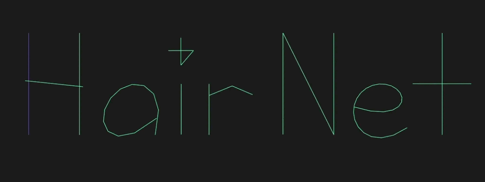

It's also displayed in the HairNet UI panel as the *"Hair Source."*

You should ensure the object you want to host the particle system is active when pressing **Convert To Hair Particles.**

The active object **must** have at least one face in order for HairNet to function.

>*Note: The active object doesn't have to be selected in order to be the active object.*

## Root Determination

Each particle in Blender's particle hair system has a special control point for the root and the tip of the particle.

By default for fibermesh and curve(s), HairNet will determine the root based on which end of the particle is **closer to the center of the object.** The center of the object is determined based on the average of all of the vertices.

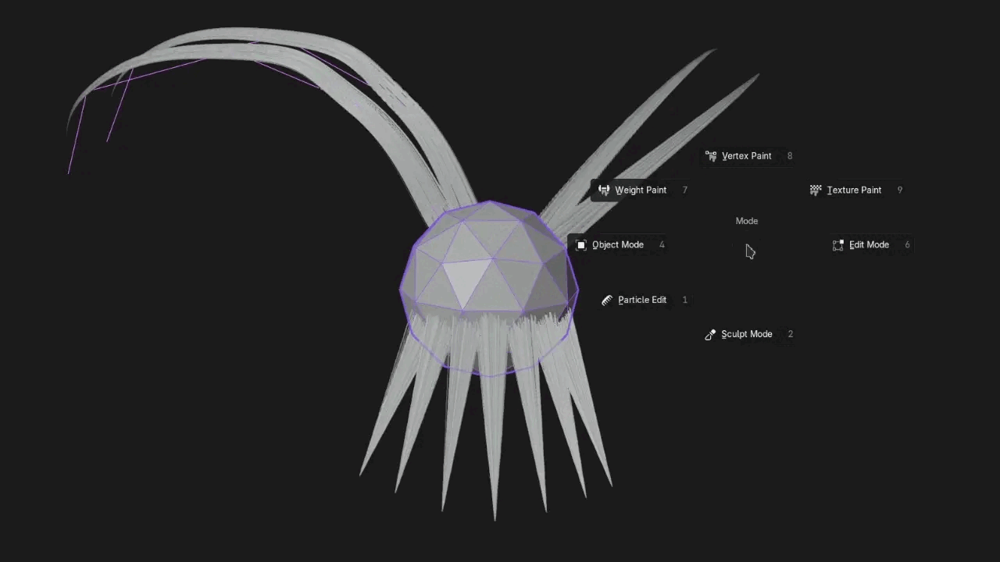

**For overriding this behavior** for fibermesh and curve(s), see [Root Select Mode](#root-select-mode) and [Root Locator](#root-locator) in the features section.

Sheetmesh roots will always be determined based on marked seams.

## "Curve" vs "Curves"

It should be noted that Blender makes a distinction between **"Curve"** objects and **"Curves"** objects. Sometimes they are also referred to as **"Curves"** and **"Curves (new)"**

Look I didn't name them okay?

"Curve" objects are Blender's original implementation of NURBS and bezier type objects. It has the **single backwards "c" shaped icon** in the outliner:

The new "Curves" type was first introduced under the label of ["Experimental Hair"](https://projects.blender.org/blender/blender/issues/95355#issue-16299) and was designed to be a replacement for the older "Curve" system.  It uses a **triple hair strand shaped icon** in the outliner and is designed to work with the new "Hair Nodes" hair system:

Both "Curve" objects and "Curves" objects will work with HairNet, however "Curves" objects **are not supported by "Root Select Mode" or by "Curve Resolution."** See their respecitve Advanced Features category for more information.

Unlike "Curve" objects Blender has a built in way to convert "Curves" into particle hair by default. However, it can be a little bit clunky in its implementation and suffers from its own limitations. That having been said, "Curves" don't have access to the full features that "Curve" objects do in HairNet either.

You can convert "Curves" without HairNet by inputting a surface with a particle system in the "object data" panel of the properties section and going to **Object>Convert>Particle System**

For the purposes of HairNet, "Curve" will be used to refer to the older system, and "Curves" will be used to refer to the newer system. Curve(s) will be used to refer to both at the same time.

See Blender's official [Curve](https://docs.blender.org/manual/en/latest/modeling/curves/introduction.html) and [Curves](https://docs.blender.org/manual/en/latest/modeling/curves_new/index.html) pages for more details on the differences between the types.

# Preparing Your Proxies

Hairnet accepts three types of proxies:

## Fibermesh
---
Fibermesh is a term for a mesh object that has no faces. In order for it to function predictably it should be on consistent string of vertices from beginning to end. Anything else won't break HairNet, but will give unpredictable results.

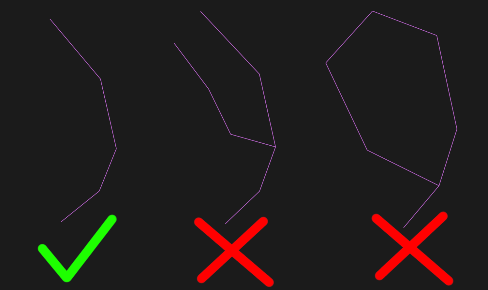

## Curve(s)
---
Curve(s) will have a singular path from one end to the other no matter how much you try to make it otherwise (unless it creates a circle), and therefore they require the least setup. However, "Curves" also *generally* give you less control over defining the final result. 

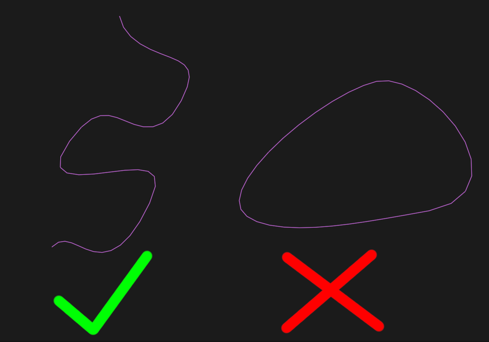

Due to the way curve(s) are calculated, a curve(s)'s final number of particle keys are not determined by it's control points alone. For curve(s) objects, the final number of keys is based upon the *"Resolution Preview U"* parameter in object data properties.

The only exception to this rule are curve(s) with a poly spline type, which will always convert with one hair key per control point.

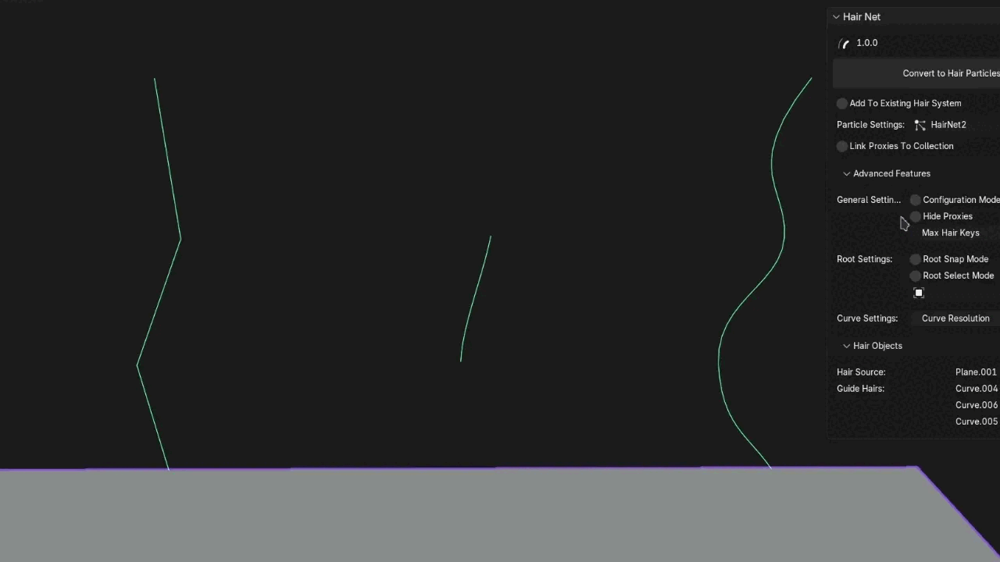

If you're confused on the difference between "Curve" and "Curves" objects see ["Curve" vs "Curves"](#curve-vs-curves)

If you want to preview how many keys the final particle will have before you convert to particles, you can convert the curve(s) object to mesh. The vertices are where the hair keys will be placed.

For changing the resolution on every "Curve" objects, see [Curve Resolution](#curve-resolution) for more details.

## Sheetmesh
---

Sheet mesh is particularly useful for converting hair cards into particle hair. It works by marking seams along the edges of meshes, and each new particle will follow one edge loop of the mesh.

You can mark a seam by going into edit mode, selecting an edge, right clicking and selecting **"Mark Seam"**

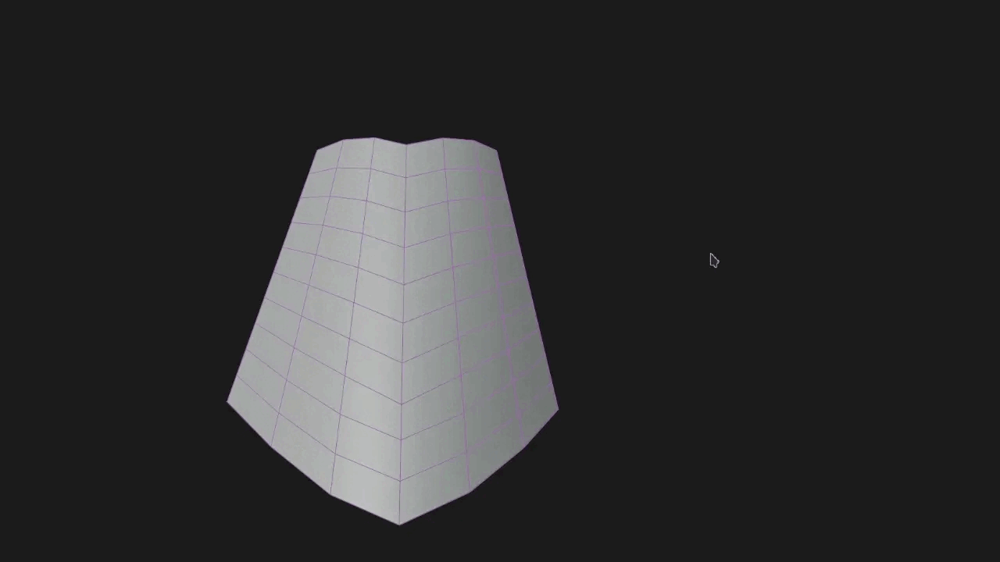

When working with sheetmesh, the behavior will produce predictable results within certain guidelines. Having an equivalent number of perpendicular edge loops per mesh for each particle will ensure the same result every time. 

Having variations in topology will sometimes extend the particles, and sometimes loop them back to the roots of the mesh. The details of why this happens are somewhat beyond this guide, but a good rule to follow is that as long as your topology isn't exceptionally outrageous things will look mostly correct.

Good and bad sheetmesh examples.

Some types of topology will cause the particle to loop infinitely, which is one reason why [Max Hair Keys](#max-hair-keys) is an important parameter to be aware of. In order to avoid any infinite loops, avoid circular looking topology.

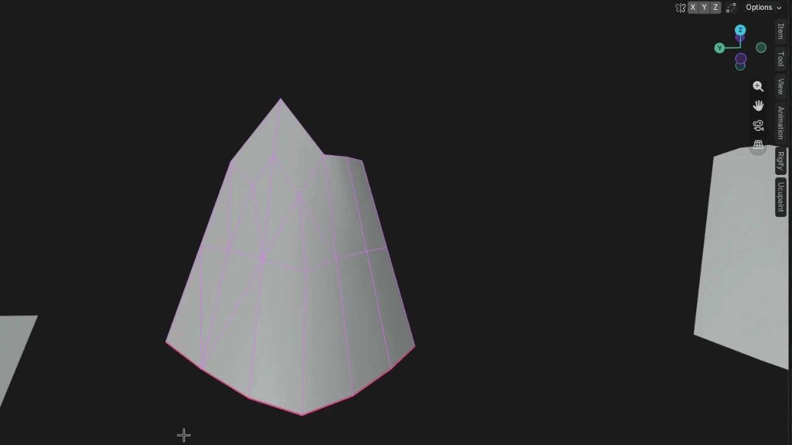

Sheetmesh are particularly useful for quickly converting hair created with cards or beveled curve(s).

## Merge By Distance

In order to avoid any unintended double keys or barely separated meshes resulting in extra particles, make sure you merge by distance before converting to hair particles. You can do this by going to **Edit Mode>Mesh>Merge>By Distance**

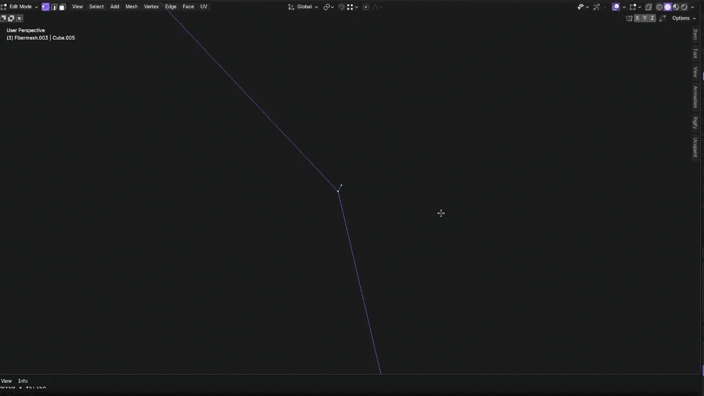

## Unhide Hair Source/Proxy Objects

The hair source must remain unhidden at the time of conversion for HairNet to function.

Additionally, in order for HairNet to recognize your proxies as selected, they must not be hidden in the viewport. 

If you've hidden your proxies in a previous particle conversion and added them to a collection, you can shift click on the eye icon on the collection to unhide them all at once.

# Features

## Particle System Settings

### Active

An upgrade over the previous version of HairNet (and Blender's built in "Curves" conversion tool), you can add any proxy object to an existing particle hair system. This will hide the particle settings option, since whatever particle settings are being used by the system will continue to be used.

When using this command, make sure the particle system you want your objects to be added to is highlighted in the particle system window.

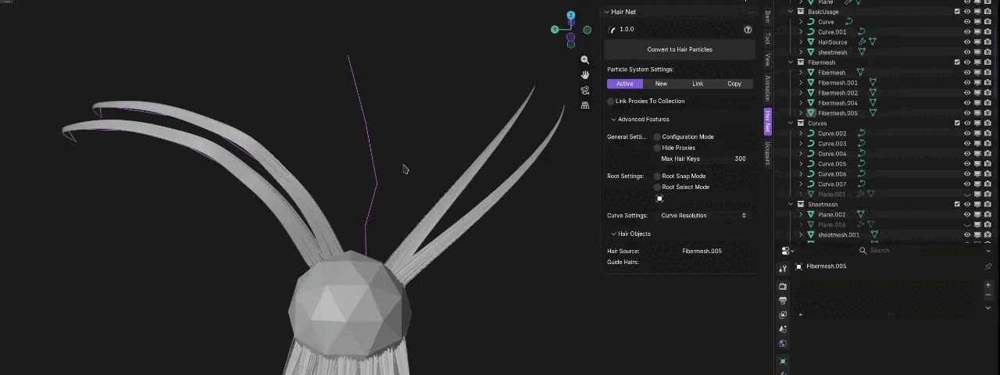

### New

New will create a new particle system with new particle settings.

### Link

This will create a new particle system with existing particle settings. Any existing particle systems that use these settings will have their settings changed when these linked settings are changed, and vice versa.

### Copy

This will create a new particle system with a copy of existing particle settings. Any existing particle systems that use these settings will **not** have their settings changed when these settings are changed.

## Link Proxies To Collection

This feature will enable you to choose a collection to add proxies to after they've been converted. You can choose an existing collection, leave it blank and it will default to "Hair_Net_Proxies" or name a new collection.

## Advanced Features

The following settings can be found in the advanced features drop down.

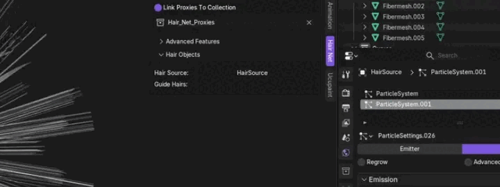

### Configuration Mode

When this is active only the initial info report will be displayed without the normal conversion to particle hair. You can access the info panel by clicking the **Editor Type** button in the top right of any area in Blender, and selecting **Info**

When a valid selection is made, it will output which object will be used as the Hair Source, which particle settings will be used, which objects will be recognized as which proxy types, and which objects are invalid and why.

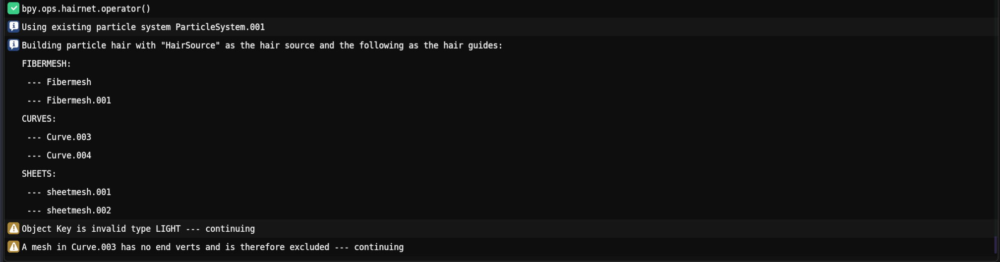

See Blender's documentation on the [Info Editor](https://docs.blender.org/manual/en/latest/editors/info_editor.html) for more details.

### Hide Proxies

Selecting this option will hide all proxy objects in the viewport after converting to particles. 

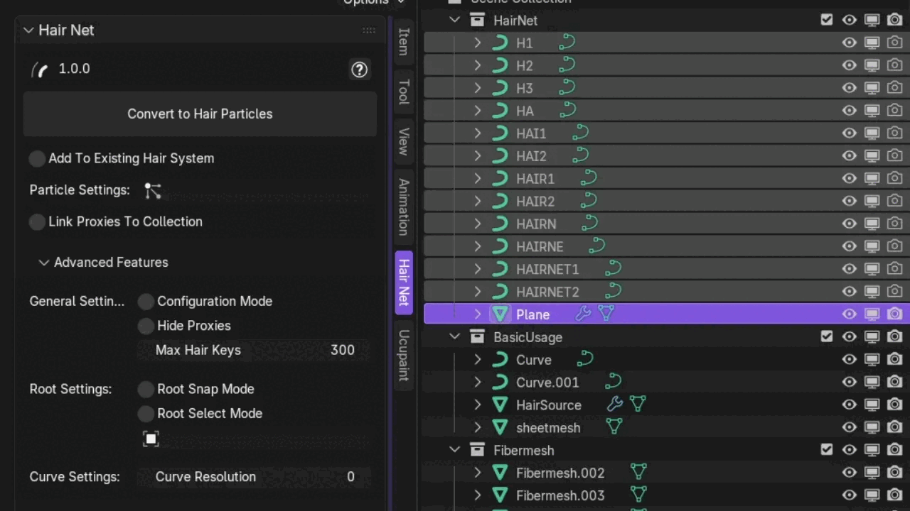

### Max Hair Keys

This option allows you to define how many keys will be generated for each individual particle before moving onto the next particle. This feature exists as a way to prevent any infinite loops from crashing Blender. It is advised to set this feature a few keys above what you anticipate being your longest hair particle.

### Root Snap Mode
Automatically attaches the roots of all proxy objects to the nearest location on the Hair Source. This is especially useful for people who plan on using the "children" feature of particle hair.

Which particle children follow is based on the root nearest to the part of the mesh that is the child's spawn location. Therefore snapping to geometry can make children look more even.

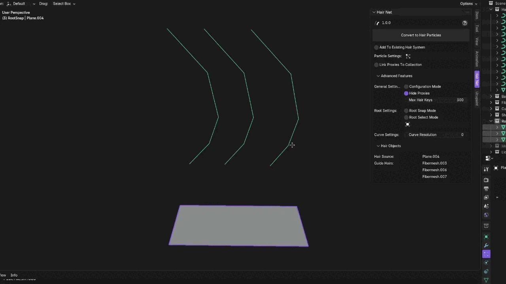

You can also use the "Connect Hair" feature of particle hair, but this causes the entire particle to move with the root. This feature enables you to get the same benefit, but by only moving the root.

### Root Select Mode

Root select mode is a way of absolutely ensuring the correct end of the proxy mesh is determined as the root. It works by selecting the mesh vertices or "Curve" control points on each proxy and letting HairNet handle the rest.

**It is recommended that you first try using [Root Locator](#root-locator) to determine the roots as it's far less time consuming.**

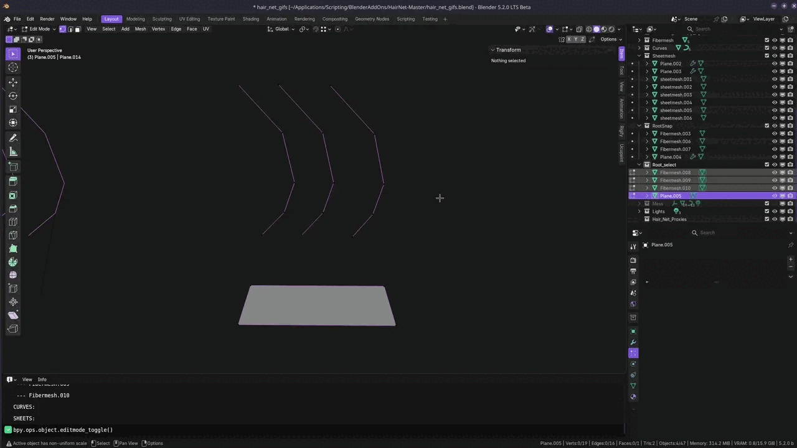

(A reminder, you should only be trying to set end verts and end control points as the root.)

If objects don't have valid selections and root select mode is enabled, it will fall back to another behavior. The order of priority for establishing the root in HairNet is **Root Select Mode > Root Locator > Hair Source Center Point**

Root Select Mode **has no effect on "Curves" or sheetmesh objects.**

Unfortunately for "Curves" objects, Blender doesn't expose the selection status of their points in the Python API, and exposes no other equivalently identifying property.

Sheetmesh is already marked by seams, and so enabling this mode for them would either be redundant or actively conflicting.

### Root Locator

By default in HairNet, the root of any given particle is determined by which endpoint is closer to the center of the **Hair Source** (the active object that hosts the particle system). The center of this object is determined by the average of all of the vertices.

The root locator works by replacing the center of the Hair Source object with location of any object. When the *transform pivot point* is set to either *bounding box center* or *individual origins* the transform will display the location used by this mode.

You can display the transform by using the toolbar button (it sits underneath the scale tool). If you still don't see it, make sure "Show Gizmo" is active in the top right section of the viewport.

Transform tool             |  Show Gizmo
:-------------------------:|:-------------------------:
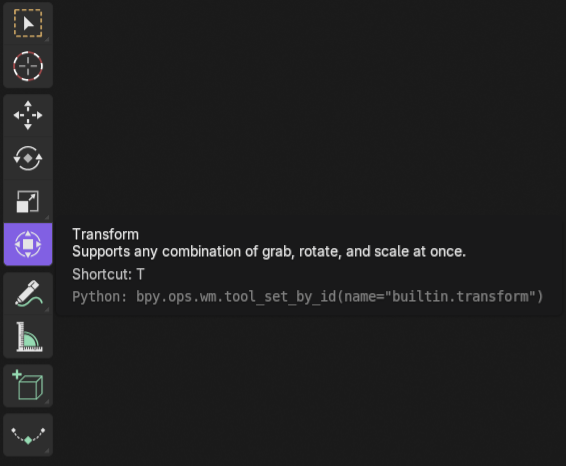   |  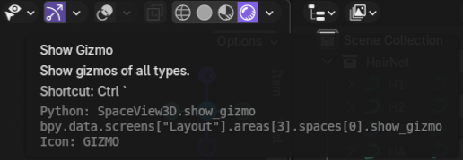

It **does apply to "Curves"** but **doesn't apply to sheetmesh.**

If no object is selected for the root locator then default behavior will be used.

### Curve Resolution

The curve resolution feature will set the number of hair keys per control point on the curve. For example, setting this value to 1 will create a particle with a hair key on every control point. Setting it to two will create 1 hair key for each control point, and also 1 hair key interpolated inbetween each control point. See the [Blender Documentation page](https://docs.blender.org/manual/en/latest/modeling/curves/properties/shape.html) for more details.

If you like, you can leave this set to 0 and the setting won't be used. Instead, the "Resolution Preview U" on each individual "Curve" object will be used when determining how many hair keys to assign. 

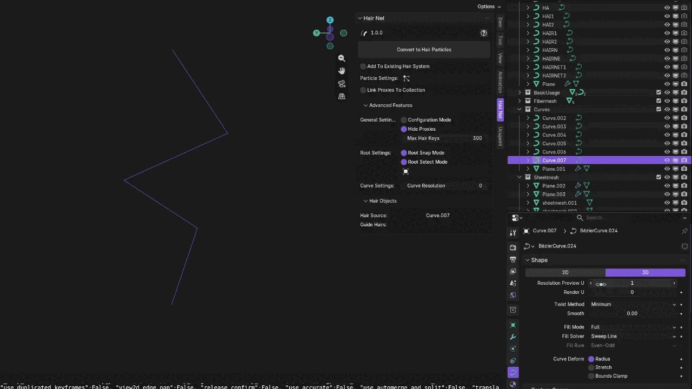

An exception to this is if your curve's spline type is set to **"Poly."** Poly is Blender's curve type that has no automatic smoothing. As a result, curve resolution has no effect. For "Curve" objects, the preview of the curve in the viewport always gives an accurate indication of where HairNet will place hair keys. You can be certain of a "Curve" object's spline type by going to **Edit Mode > Curve > Set Spline Type > [Choose Type]**

This setting has no effect on "Curves" objects. See ["Curve" vs "Curves"](#curve-vs-curves) for more details.

## Improvements

Some non-feature specific improvements have been made to the old HairNet:

### Automatic Object Space Transformation

As an upgrade to the previous version of HairNet, the proxy objects automatically have their object space recalculated when creating proxy hair.

This results in no longer requiring the proxy objects to share the same transform as the **Hair Source.**

### All Proxies Can Be Converted at Once

With the old HairNet, you could only convert one type of proxy at a time (e.g. only fibermesh, only sheetmesh, only curves). Now you can convert all types of proxies with the click of one button, and HairNet will intelligently sort out the rest.

### Variable Hair Key Amounts

Proxy objects can now have keys of varying length when assigning to a particle system! It's no longer required for all objects to conform to the same number of hair keys.

# Limitations

### Particle Generation

The only way to create a particle through the Blender Python API is to use the add particle brush. This requires (as you might imagine) a brush action to be taken. HairNet achieves this by framing the active Hair Source object, and calling a brush edit action in the direct center of the viewport for each particle that needs to be created.

The upside to this method is that it frees us to both add particles to existing systems and create particles of various key amounts (both upgrades over the previous version of HairNet).

The downside is that it's hacky to use and can result in a specific error. If the mesh of the object allows for angles where framing it doesn't result in a face in the center of the screen, no particles can be generated. See ["Could not create particle"](#could-not-create-particle) for more details.

### Root Select Mode doesn't apply to "Curves" or objects with mutliple islands

Unfortunately, Blender's python API doesn't expose any user defined custom information about control points on "Curves" objects that could be used as a way to mark them as roots. As a result, only Root Locator is supported for determining roots for "Curves" objects outside of default functionality. "Curve" objects do have support for Root Select Mode. 

See [Curve vs Curves Objects](#curve-vs-curves) for more info on the difference between these object types.

If you need more intelligent root selection for "Curves" objects, you can rely on ["Root Locator."](#root-locator) Blender's default conversion to particle system also provides this functionality by automatically setting the root based on the direction of the normal of the "Curves."

Root Select Mode also doesn't work on meshes/curves with multiple islands/splines. This is because in Blender separating meshes loses the selection of components, and is necessary for HairNet's functionality. 

If you absolutely need this feature I recommend considering using sheetmesh (wherein marking seams is a better version of Root Select Mode), or separating out these proxies yourself prior to converting.

### Beveled curves not supported

As of right now, HairNet doesn't support beveled curve objects. If you still wish to use beveled curves a workaround would be to duplicate the beveled object, convert it to mesh, and use the converted mesh as a sheetmesh object.

Alternatively you may use the curve itself by removing the bevel.

# Troubleshooting

## "Why does my particle hair look weird?"

There are a number of reasons your particle hair might end up initially looking strange after conversion. Here are two of the more common ones:

### Strand Steps

Switch to object mode and go to the active particle system's settings. Under "Viewport Display" increase "Strand Steps" until you're satisfied with the result. For very long particles you may need to manually enter a higher number than 7, which is the soft cap Blender imposes. Be careful though, this setting increases exponentially.	

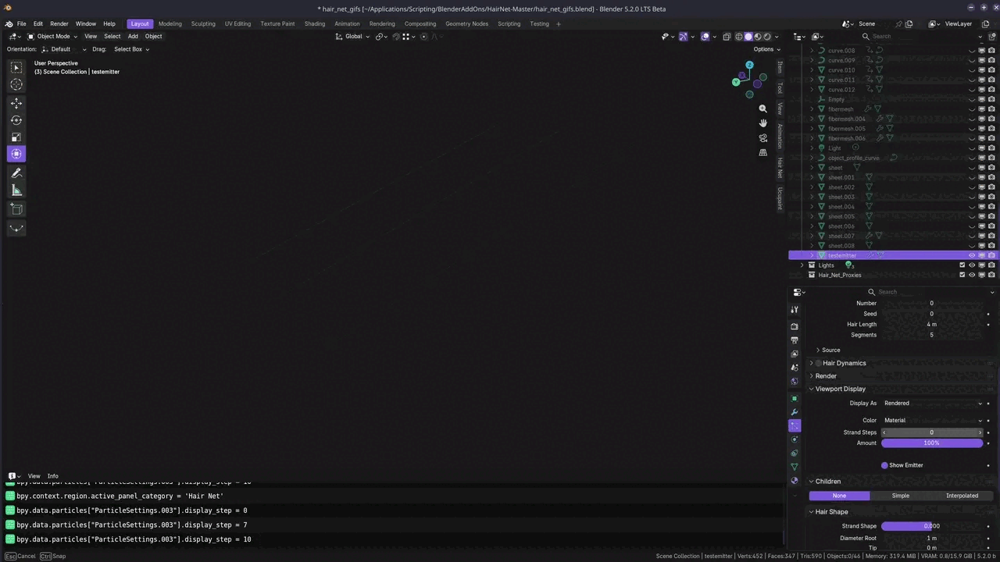

This setting is also changed in two other locations, directly above the viewport display dropdown is a render dropdown where strand steps can be changed for when the image is rendered. The final location is in particle edit mode in the 3d viewport panel under **Tool > Options > Viewport Display > Path Steps**

### Setting the roots for children

It may just be the children of your particles that look strange. Try setting children to none in particle settings and you might find your particles perfectly follow their proxies.

If this is the case in your situation, see [Root Snap Mode](#root-snap)

## "Could not create particle"

This tool relies on a face of the **Hair Source** object being directly in the center of the screen. It must be a face, and it must be directly in the center of the screen. Sometimes with tool panels extending over half the viewport where the middle of the screen actually is can be deceptive.

Since HairNet automatically frames the object when creating particles, the user only has to find the correct rotation of the view camera to line up with a face of the object.

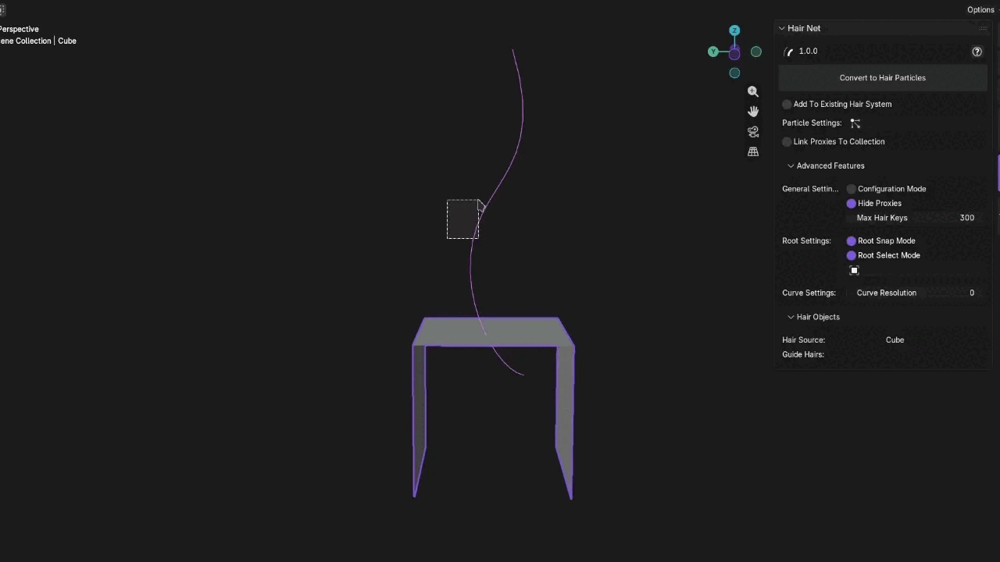

If nothing else, create a temporary face for the particles to build to, then delete it after the particles are created.

See [Particle Generation](#limitations) For more details

## HairNet isn't recognizing my proxy!

If you're not getting any acknowledgement of your proxy in the info box it's most likely hidden. In order for HairNet to recognize a proxy it must be **selected and unhidden.**

See [Configuration Mode](#configuration-mode) for more information about Blender's info box.

## "Why were multiple particles created along the length of the proxy?"

It's likely that your mesh consists of multiple islands of geometry. You can confirm this by going into Edit Mode, selecting a vert, and **Select > Select Linked > Linked**

The parts of your geometry that are selected are the parts connected to that initial vertex. See [Merge By Distance](#merge-by-distance) for more on solving this.

## "Why doesn't my particle extend through my whole Fibermesh?"

It's likely that at the point where your particle should contine there's a very insignificant extruded vertex in your mesh.

See [Merge By Distance](#merge-by-distance) for more on solving this.

Another possibility is that the particle hit its [Max Hair Keys](#max-hair-keys) limit. This can be confirmed by checking the Blender's Info Editor.

## "No valid fibers along the seam(s) of sheetmesh, [proxy]"

There are two reasons you could be getting this warning.

The first is that no valid edge loops were found on the marked seams of the given sheetmesh. Consult [Sheetmesh](#sheetmesh) for details on how to properly set up this proxy type.

The second is that you may have an island of mesh on the object you aren't aware of. To be sure of this you can select the object, go into **Edit Mode > Mesh > Separate > By Loose Parts**

Otherwise, if you're getting the particle hair results you want the warning is harmless.

# Contributing - 

Pull requests are welcome! For major changes, please open an issue first to discuss what you’d like to change. Outside of what's listed below, please feel free to work on improving HairNet in any way you like!

## Places For Improvement:
---

In loose order of importance:

### Link vs Duplicate Particle Settings

C

### Sheet mesh auto mark seams

A tool to intelligently auto-mark seams on sheet mesh could significantly save time for people who are generating proxy hair from existing hair cards.

### Improved root snapping behavior

Make it so the root snap decides more intelligently which part of the mesh to snap to based on the preceeding arc of the proxy

### More efficient processing algorithms

Any way the add-on can be made faster is good :)

### Beveled curve support

Allowing users to convert beveled curves would be ideal.

### Support for root select mode on multiple meshes

Currently Root Select Mode does not support multiple meshes. It would be ideal if there were a workaround for the separate meshes issue. It might be possible with the bmesh module.

### Reset the camera to it's original position

It's just a pet peeve of mine, but something about the paritcle brush edit prevents the view from being reset. This is likely a bug with blender, but if you can figure it out then that's dope.

### Checkout the "final_particle_system_cleanup" method :P

It's somethin.

# Report A Bug - 

Before you report a bug please consult the troubleshooting section above to ensure it's not known behavior. Pay close attention to where the hair keys are, not what the particle looks like. 

The visual of the particle can be the result of many factors HairNet has no control over.

There are some preliminary steps you should take before determining it's a bug:

1. Restart Blender 
2. Restart your computer
3. Try replicating the behavior in a completely new scene.

If the bug remains, feel free to log an issue in the [issues panel.](https://github.com/HoloXXXX/HairNet/issues)

# Buy me a coffee ☕ -

Check out my [Ko-fi!](https://ko-fi.com/Holo_X)

By making this tool available for free, I receive no direct revenue for the time and passion I've put into this project.

A donation is of course, optional (and always will be for this project), but much appreciated if you wish to support my work!

# License -

[GNU General Public License v3.0](https://github.com/HoloXXXX/HairNet/blob/master/LICENSE)`

 
 
 
 
 
 
 
 
 
 
 
 
 
 
 
 
 
 
 
 
 
 
 
 
 
 
 
 
 
 
 
 
 
 
 
 

